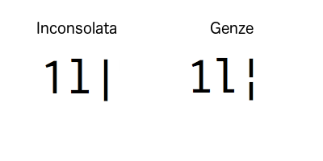

# Genze
A little bit tweaked [Inconsolata](http://levien.com/type/myfonts/inconsolata.html)

## Diff between Inconsolata
I. Lower L (`l`) (and related glyphs)

II. Numeral one (`1`) has serif

III. Vertical bar is broken bar

## Why named `Genze`
**現世** (Genze, \[Gen-Zay\]) is the Japanese word meaning *the world for living people*.

Inconsolata -> Consolas -> console -> con-SOUL -> soul -> ...
